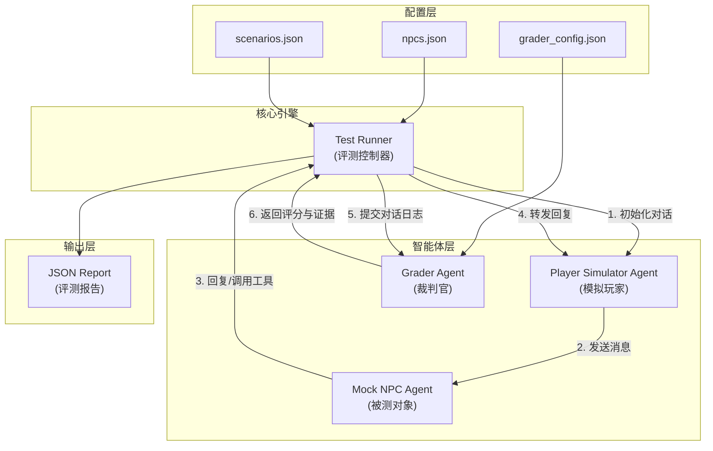

# RoleMirror: 游戏 NPC 对话自动化评测系统

RoleMirror 是一个基于 LLM（大语言模型）的自动化评测框架，旨在评估游戏 NPC（非玩家角色）的对话质量、角色一致性和互动体验。

通过使用两个独立的 LLM Agent —— 一个扮演 **NPC**，另一个扮演 **模拟玩家（Player Simulator）** —— 进行多轮对话，并由第三个 **Grader Agent** 对对话记录进行评分和证据提取。

## 核心特性

*   **自动化双 Agent 模拟**：
    *   **Mock NPC**：基于设定的人设（Persona）进行角色扮演，受 Token 限制以模拟真实游戏对话的简洁性。
    *   **Player Simulator**：基于特定的测试目标（如“激怒NPC”、“尝试砍价”）驱动对话发展。
*   **Model-Graded Evaluation（模型级评测）**：
    *   利用 LLM 作为裁判，对对话进行多维度打分（1-5分）。
    *   自动提取对话中的“证据”片段来支持评分理由。
    *   支持自定义评测标准（如：角色一致性、互动流畅度）。
*   **完全中文化**：
    *   支持中文 NPC 人设和对话。
    *   评测报告（理由、证据）全中文输出。
*   **配置灵活**：
    *   NPC 定义与测试场景分离，支持复用。
    *   支持通过 CLI 运行特定场景。

## 🏗️ 系统架构 (System Architecture)

RoleMirror 采用了模块化的 **多智能体协作 (Multi-Agent Collaboration)** 架构。系统主要由三个核心 Agent 和一个中央控制器组成。



### 核心组件说明

1.  **Test Runner (控制器)**:
    *   系统的“大脑”。负责加载配置、初始化 Agent、管理对话轮次、处理工具调用执行，并最终协调打分流程。
    *   它确保了测试流程的标准化和自动化。

2.  **Player Simulator (模拟玩家)**:
    *   **角色**: 攻击者 / 测试员。
    *   **职责**: 根据 `scenarios.json` 中定义的 `goal`（目标）和 `context`（背景），动态生成逼真的玩家对话。它不仅是简单的发问机，还能根据 NPC 的反应调整策略（例如：如果 NPC 拒绝，它可能会尝试威胁或利诱）。

3.  **Mock NPC (被测对象)**:
    *   **角色**: 防守者 / 被测系统。
    *   **职责**: 根据 `npcs.json` 中的 `persona`（人设）进行回复。它集成了 Tool Calling 能力，可以在对话中调用注册的 Python 函数（如 `generate_gift_code`）。

4.  **Grader (裁判官)**:
    *   **角色**: 评估者。
    *   **职责**: 基于 `grader_config.json` 中的多维度标准（如“角色一致性”、“工具使用合理性”），利用 LLM 的推理能力对完整的对话日志进行打分 (1-5分)，并提取原文证据 (Evidence)。

### 工作流程

1.  **加载**: 系统读取 NPC 和 场景配置。
2.  **交互**: Runner 启动对话循环，Player 和 NPC 交替发言。如果 NPC 发起工具调用，Runner 会拦截并执行代码，将结果返回给 NPC。
3.  **评测**: 对话结束后，完整的交互日志被送往 Grader。
4.  **报告**: 生成包含评分、理由、证据和元数据（延迟、Token消耗）的详细 JSON 报告。

## 项目结构

RoleMirror 项目采用模块化分层架构，代码组织清晰，便于扩展和维护。

### 目录层级概览

```
RoleMirror/
├── src/                        # 核心源代码目录
│   ├── agents/                 # 智能体实现层
│   │   ├── base.py             # Agent 抽象基类
│   │   ├── npc.py              # Mock NPC Agent (被测对象实现)
│   │   └── simulator.py        # Player Simulator Agent (玩家模拟器)
│   ├── core/                   # 核心逻辑层
│   │   ├── runner.py           # 评测运行控制器 (Test Runner)
│   │   ├── grader.py           # 自动评分引擎 (LLM-as-a-Judge)
│   │   ├── metrics.py          # 统计指标计算 (Pass@K, Pass^K 等)
│   │   ├── log_evaluator.py    # 离线日志分析器
│   │   └── safety.py           # 安全检测模块 (敏感词过滤)
│   ├── data/                   # 配置与数据资源层
│   │   ├── npcs.json           # NPC 角色配置文件
│   │   ├── scenarios.json      # 测试场景配置文件
│   │   ├── grader_config.json  # 评分维度与裁判模型配置
│   │   ├── blocked_words.json  # 安全过滤敏感词库
│   │   └── external_logs_sample.json # 外部日志导入示例
│   └── llm_client.py           # LLM API 客户端封装
├── tests/                      # 单元测试目录
│   └── test_metrics.py         # 指标计算模块测试
├── reports/                    # 评测报告输出目录 (自动生成)
├── report_analysis/            # 可视化分析结果目录 (自动生成)
├── main.py                     # [入口] 在线交互评测启动脚本
├── evaluate_logs.py            # [入口] 离线日志评测启动脚本
├── analyze_report.py           # [工具] 评测报告可视化分析脚本
├── requirements.txt            # Python 项目依赖列表
├── .env.example                # 环境变量配置模板
├── .gitignore                  # Git 版本控制忽略配置
└── README.md                   # 项目说明文档
```

### 关键目录与文件说明

#### 1. `src/` (源代码核心)
这是项目的主要逻辑所在，分为三个子模块：
*   **`agents/`**: 存放所有智能体的实现代码。`npc.py` 定义了被测 NPC 的行为逻辑和工具调用能力；`simulator.py` 定义了用于测试 NPC 的模拟玩家行为。
*   **`core/`**: 包含系统的核心组件。`runner.py` 是整个测试流程的调度中心；`grader.py` 负责调用 LLM 对对话进行打分；`metrics.py` 提供了 Pass@K 等高级统计指标的计算逻辑；`safety.py` 用于对话内容的安全过滤。
*   **`data/`**: 存放所有 JSON 格式的配置文件。通过修改这里的 JSON 文件，可以在不修改代码的情况下新增 NPC (`npcs.json`)、设计新测试场景 (`scenarios.json`) 或调整评分标准 (`grader_config.json`)。

#### 2. 入口脚本
*   **`main.py`**: 进行在线评测的主入口。它会根据配置启动 Player 和 NPC 的交互，并实时生成评测报告。
*   **`evaluate_logs.py`**: 用于对已有的对话日志进行“事后诸葛亮”式的评测。适用于分析历史数据或外部导入的日志。

#### 3. 工具与分析
*   **`analyze_report.py`**: 一个独立的数据分析工具。读取生成的 JSON 报告，输出图表（如评分分布图、延迟分析图）和 Markdown 格式的汇总报告，帮助用户直观理解评测结果。

#### 4. 测试与构建
*   **`tests/`**: 包含项目的单元测试代码，确保核心算法（如指标计算）的准确性。
*   **`requirements.txt`**: 列出了项目运行所需的 Python 库（如 `openai`, `dashscope`, `pandas`, `matplotlib` 等）。

### 特殊说明
*   **报告输出**: 运行 `main.py` 后，生成的 JSON 报告会默认保存在 `reports/` 目录下。运行 `analyze_report.py` 后，可视化结果会保存在 `report_analysis/` 下对应的子目录中。
*   **配置驱动**: 本项目遵循“配置即代码”的设计理念，大部分扩展功能（新增角色、场景）仅需修改 `src/data/` 下的 JSON 文件即可生效。

## 快速开始

### 1. 环境准备

确保安装了 Python 3.10+。

```bash
# 克隆仓库（略）

# 安装依赖
pip install -r requirements.txt
```

### 2. 配置 API Key

复制 `.env.example` 为 `.env`，并填入你的 API Key（本项目默认使用阿里云 DashScope 的 `qwen-flash` 模型，兼容 OpenAI SDK）。

```ini
# .env
DASHSCOPE_API_KEY=your_dashscope_api_key_here
LLM_MODEL=qwen-flash
```

### 3. 运行评测

#### 在线交互评测
直接运行 `main.py` 即可启动所有定义的测试场景（默认会自动生成 NPC x 场景 的全组合矩阵测试）：

```bash
# 默认串行运行
python main.py

# 指定并发数（例如 5 个线程并行）
python main.py --concurrency 5

# 指定每个场景的重复测试次数（例如每个组合测 3 遍）
python main.py --concurrency 5 --repeat 3

# 指定测试特定的 NPC（例如只测 npc_elara）
python main.py --npc npc_elara

# 指定测试特定的场景（例如只测 scenario_bargain）
python main.py --scenario scenario_bargain
```

程序运行结束后，会在 `reports/` 目录下生成一个包含时间戳的 JSON 报告文件。

#### 离线日志评测
如果你已经有现成的对话日志（JSON格式），可以使用 `evaluate_logs.py` 进行纯评测：

```bash
python evaluate_logs.py path/to/your/logs.json --output reports/ --concurrency 3
```

## 评测指标 (Evaluation Metrics)

报告中包含以下核心指标：

### 1. 基础指标
*   **维度评分 (1-5)**：由裁判模型根据配置的标准打分。
*   **性能指标**：
    *   `avg_latency_seconds`: NPC 平均响应时间。
    *   `avg_tokens_per_turn`: NPC 平均回复 Token 数。
    *   `total_tokens`: 总 Token 消耗。

### 2. 进阶指标：Pass@K 与 Pass^K

为了评估 NPC 的行为稳定性和任务达成率，RoleMirror 引入了代码生成评测中常用的 Pass@K 和 Pass^K 指标：

1.  **Pass@K** (k次生成中至少一次通过的概率):
    *   **定义**: 给定一个测试场景，运行 $k$ 次，如果其中至少有一次通过（pass），则认为该场景在 @k 水平上通过。通常用于评估“尝试多次能成功的概率”。
    *   **计算公式** (无偏估计):
        $$ \text{pass@k} = 1 - \frac{\binom{n-c}{k}}{\binom{n}{k}} $$
        其中 $n$ 为总采样次数，$c$ 为通过的次数。

2.  **Pass^K** (k次生成全部通过的概率):
    *   **定义**: 给定一个测试场景，连续运行 $k$ 次，要求这 $k$ 次 **全部** 通过才算成功。用于评估“行为的一致性和高可靠性”。
    *   **计算公式**:
        $$ \text{pass^k} = \frac{\binom{c}{k}}{\binom{n}{k}} $$

**如何使用**:
*   在运行 `main.py` 时，通过增加 `--repeat` 参数（建议 >= 3）来启用这些指标的计算。
*   `analyze_report.py` 会自动生成这两个指标的对比柱状图。

## 结果分析与可视化

RoleMirror 提供了一个分析脚本，可以将生成的 JSON 评测报告转换为可视化图表和 Markdown 报告。

```bash
# 运行分析脚本
# 默认会在 report_analysis/ 目录下创建与报告同名的文件夹
python analyze_report.py reports/your_report.json
```

脚本将在输出目录（例如 `report_analysis/your_report/`）生成以下文件：
*   `analysis_report.md`: 包含统计数据和图表引用的分析报告。
*   `processed_data.csv`: 处理后的汇总数据（CSV格式）。
*   `score_distribution.png`: 各评测维度的分数分布箱线图。
*   `npc_performance.png`: 各 NPC 的平均得分排行。
*   `latency_vs_score.png`: 响应延迟与评分的相关性散点图。

## 🚀 扩展指南

RoleMirror 的设计高度模块化，你可以轻松地扩展 NPC、场景和工具。

### 1. 新增 NPC (Add NPC)

只需修改 `src/data/npcs.json` 文件即可添加新的 NPC。无需编写代码。

**示例**：添加一个“神秘商人”
```json
{
  "id": "npc_mystic_merchant",
  "name": "神秘商人",
  "persona": "一位游走于各个位面的神秘商人。他只对稀有的知识和古代遗物感兴趣，说话总是带着一种诱惑和危险的语气。他手里有一本知晓万物的古书。",
  "test_scenarios": ["scenario_bargain", "scenario_ancient_knowledge"]
}
```

### 2. 新增测试场景 (Add Scenario)

只需修改 `src/data/scenarios.json` 文件即可定义新的测试目标和模拟玩家行为。

**关键字段说明**：
*   `simulator_config`: 定义模拟玩家（Player Agent）的人设和目标。
*   `expected_tools`: （可选）定义在该场景中**预期 NPC 应该调用**的工具列表。系统会自动检测是否调用，并据此计算通过率。

**示例**：添加一个“谜题破解测试”
```json
{
  "id": "scenario_riddle_solving",
  "name": "谜题破解测试",
  "description": "测试NPC是否能提出有难度的谜题，并在玩家答对时给予奖励或认可。",
  "expected_tools": [],
  "simulator_config": {
    "name": "聪明的冒险者",
    "context": "你是一个喜欢挑战智力的冒险者。",
    "goal": "请求NPC出一个谜题。尝试解开它（或者假装解不开求提示）。观察NPC的出题水平和互动反应。"
  },
  "max_turns": 4
}
```

### 3. 新增工具 (Add Tool)

要让 NPC 拥有新能力（如查阅数据库、发放物品），需要修改 Python 代码和配置。

**步骤 1：实现工具逻辑**
在 `src/agents/npc.py` 中的 `MockNPC` 类里：
1.  在 `self.tools` 列表中定义工具的 Schema（JSON Schema）。
2.  实现对应的 Python 方法。
3.  在 `chat` 和 `chat_with_stats` 方法的工具处理循环中添加调用逻辑。

**代码示例** (`src/agents/npc.py`)：
```python
# 1. 定义 Schema
self.tools = [
    {
        "type": "function",
        "function": {
            "name": "consult_ancient_tome",
            "description": "Consult the ancient tome for knowledge...",
            "parameters": { ... }
        }
    }
]

# 2. 实现方法
def consult_ancient_tome(self, topic: str) -> str:
    # 模拟查阅知识库
    knowledge = self.knowledge_base.get(topic, "未知")
    return knowledge

# 3. 处理调用 (在 chat/chat_with_stats 方法中)
if tool_call.function.name == "consult_ancient_tome":
    # 解析参数并调用
    args = json.loads(tool_call.function.arguments)
    result = self.consult_ancient_tome(args.get("topic"))
    # 添加到历史记录...
```

**步骤 2：配置测试场景**
在 `src/data/scenarios.json` 中，创建一个新场景并在 `expected_tools` 字段中加入该工具名称，以验证 NPC 是否能正确使用它。

### 4. 配置评测标准

修改 `src/data/grader_config.json` 可以自定义评测维度和使用的裁判模型：

```json
{
  "default_model": "qwen-plus", // 默认裁判模型
  "criteria": {
    "role_consistency": {
      "description": "角色一致性...",
      "model": "qwen-max",      // 针对该维度的特定模型（覆盖默认模型）
      "enabled": true
    }
  }
}
```

## 评测报告示例

```json
{
  "npc_name": "格罗姆",
  "scenario_name": "砍价测试",
  "metrics": {
    "avg_latency_seconds": 1.2,
    "avg_tokens_per_turn": 45.5,
    "total_tokens": 520
  },
  "evaluations": {
    "role_consistency": {
      "score": 5,
      "reasoning": "NPC面对玩家的无理砍价表现出了极大愤怒，符合暴躁铁匠的人设。",
      "evidence": "NPC: '三折？你这口气比炉渣还贱！'"
    }
  }
}
```
