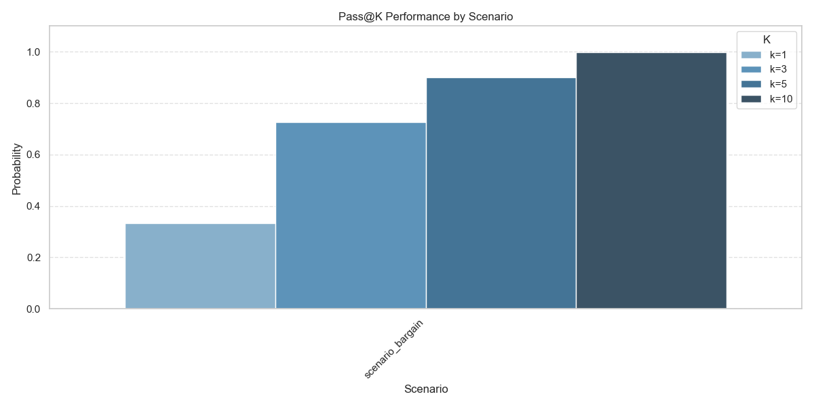
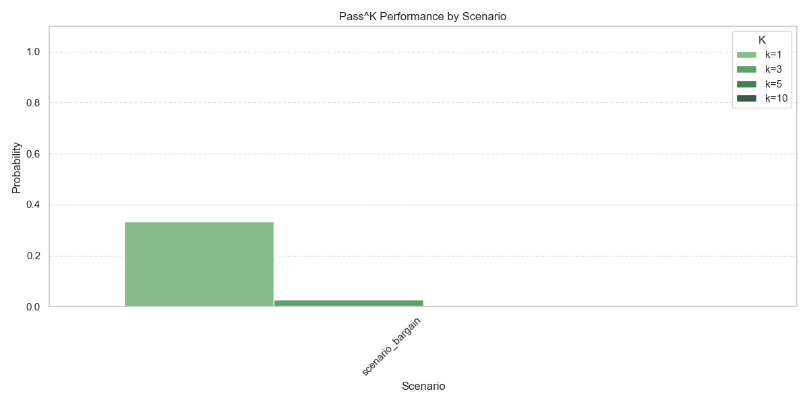
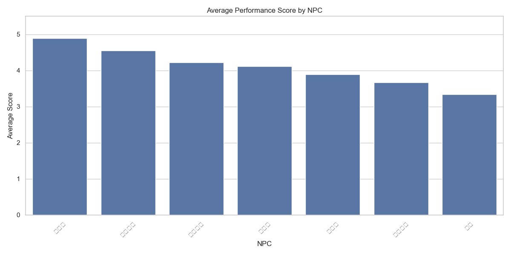
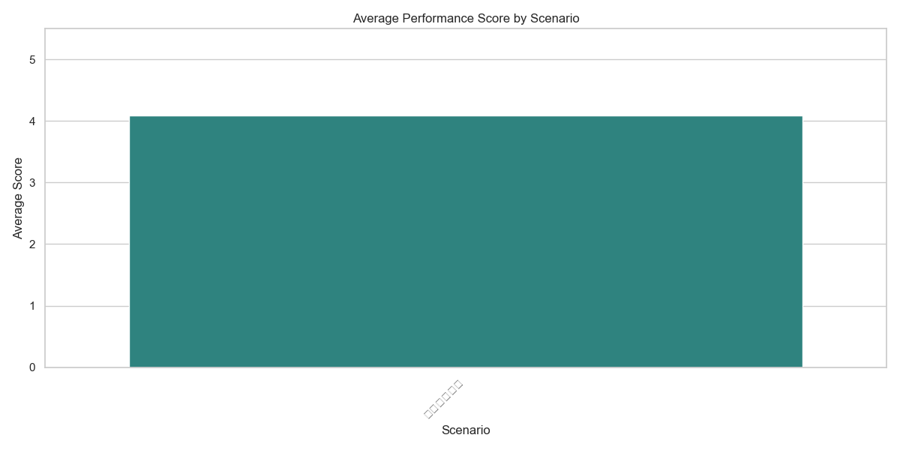
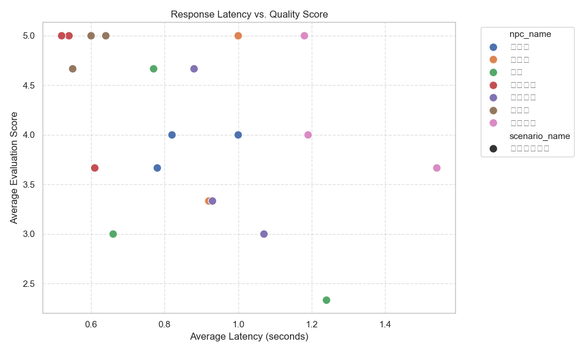

# Analysis Report: report_20260121_220303.json

## 1. Summary Statistics
- **Total Test Cases**: 21
- **Overall Average Score**: 4.10 / 5.0

- **Best Performing NPC**: 守卫李 (Avg Score: 4.89)
- **Lowest Performing NPC**: 暗影 (Avg Score: 3.33)

- **Best Performing Scenario**: 极限砍价测试 (Avg Score: 4.10)
- **Lowest Performing Scenario**: 极限砍价测试 (Avg Score: 4.10)
- **Average Response Latency**: 0.88 seconds
- **Average Tokens per Turn**: 970.10
- **Total Tokens Consumed**: 101,861

## 2. Pass Metrics (Pass@K & Pass^K)
Evaluation of generation success probability and consistency across multiple attempts.

### Metric Definitions
- **Pass@K**: Probability that **at least one** correct result exists in the first K generations.
- **Pass^K**: Probability that **all** K generations are correct.

### Visualization

### Detailed Metrics Table
| Scenario | Metric | k=1 | k=3 | k=5 | k=10 |
|---|---|---|---|---|---|
| scenario_bargain | Pass@K | 0.3333 | 0.7263 | 0.9016 | 0.9972 |
| scenario_bargain | Pass^K | 0.3333 | 0.0263 | 0.001 | 0.0 |

### Detailed Criteria Scores

| Criteria | Average Score |
|---|---|
| role_consistency | 4.62 |
| interaction_quality | 4.43 |
| tool_usage | 3.24 |

## 3. Score Distribution
The following boxplot shows the distribution of scores across different evaluation criteria.

## 4. Performance Analysis
### 4.1 By NPC
Average performance scores broken down by NPC character.

### 4.2 By Scenario
Average performance scores broken down by Test Scenario. This helps identify which scenarios are most challenging for the NPCs.

## 5. Latency Analysis
Correlation between response time (latency) and quality score.

